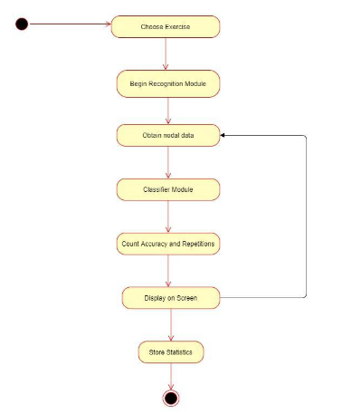

# Phys.io
### Recommending and Monitoring Physiotherapy exercises
Here we created an application that does pose estimation using the PoseNet model, the output of which is sent to our custom Classifier model to check if the user is in the required pose. From this, we infer the repetitions and accuracy. We are also showing the next move to be performed. We are taking the pain range of the user's joints using which we can recommend them specific set of exercises. 
  
All the data collection and training were done in JavaScript using the ml5js library. We created a specific tool for data collection (did lose some pounds creating the dataset itself 😛).
  
We also deployed our project on the cloud, using: 

**AWS EC2** - mainly to host our NodeJs server 
**AWS S3** - for storing large size profile pictures 
**MongoDB Atlas** - hosting our database 
 
Special thanks to The Coding Train for teaching us this stuff 😁.
 
 
Video Demo : https://youtu.be/N1kkNUhd44I
 
 

	

 

### Application design:
 

		

 
 

		

 

### Team:
Pratik Mahankal
 
Nigel Malappan
 
Monish Raval
 
Nigel Lobo